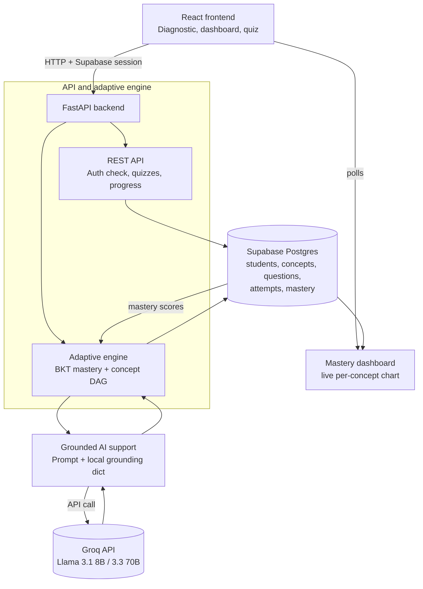

# Architecture

## Overview

Boring, zero-setup-friction stack throughout — every choice below is a
managed service or a standard library, nothing self-hosted or requiring
infra setup during the hackathon.

- **Frontend**: React (Vite) + Tailwind CSS + Recharts, deployed to Vercel
  or Netlify.
- **Backend**: FastAPI (Python), deployed to Render or Railway.
- **Database**: Supabase (managed Postgres). Also provides auth, so no
  custom auth is written.
- **AI**: Groq API — Llama 3.1 8B for latency-sensitive calls (quiz
  feedback, hints), Llama 3.3 70B for concept explanations.
- **Real-time**: simple polling from the frontend dashboard (every few
  seconds) against the mastery endpoint — no websocket infra needed for an
  8-hour build; upgrade to Supabase Realtime only if time remains.
- **Storage**: none needed — no file uploads in MVP scope.

## Data flow

1. Frontend authenticates via Supabase Auth, gets a student session.
2. Frontend calls FastAPI endpoints for diagnostic, path, quiz, and mastery
   data — FastAPI is the only service that talks to Postgres directly
   (service role key stays server-side).
3. On each quiz answer: FastAPI writes to `attempts`, runs the BKT update,
   writes to `mastery`, then selects the next question's tier from
   `questions` based on the updated score.
4. When an explanation or hint is needed, FastAPI builds a prompt from the
   local grounding dict (per-concept definition + example) plus the
   question context, calls Groq, and returns the result — Groq never talks
   to the database directly.
5. Frontend dashboard polls the mastery endpoint and re-renders the
   per-concept chart.

## Diagram

## Database schema

- `students(id, name, created_at)`
- `concepts(id, name, prerequisite_ids jsonb)` — the concept DAG
- `questions(id, concept_id, difficulty_tier int 1-3, body, options, correct_answer)`
- `attempts(id, student_id, question_id, correct bool, timestamp, response_time_ms)`
- `mastery(student_id, concept_id, p_mastery float, last_updated)` — default
  `p_mastery = 0.3` (BKT prior) when no row exists yet

## Risk flags

- **Groq rate limits**: free tier can throttle under rapid repeated calls —
  mitigated by caching generated explanations per concept+tier and having a
  static fallback (see `RISK_REGISTER.md`).
- **Supabase free-tier connection limits**: fine at hackathon-demo scale
  (single-digit concurrent users), not a concern here.
- Nothing in this stack requires a paid tier, an approval wait, or fragile
  local setup — no cuts needed on infrastructure grounds.